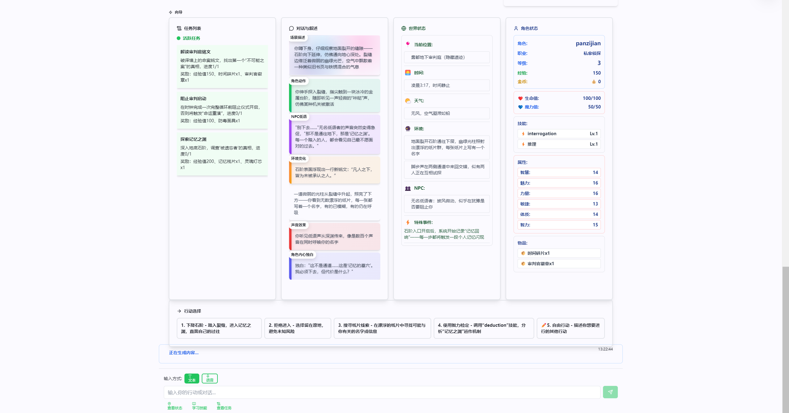

# QN Contest - 角色扮演AI系统

一个基于Spring Boot和LangChain4j的智能角色扮演AI系统，支持多种世界类型的沉浸式角色扮演体验。
## 产品规划与用户分析

### Q: 你计划将这个网页面向什么类型的用户？这些类型的用户他们面临什么样的痛点，你设想的用户故事是什么样呢？

**A: 目标用户群体与痛点分析**

我们主要面向以下四类用户：

#### 1. 学生与终身学习者
- **痛点**: 传统学习方式枯燥乏味，难以坚持；缺乏沉浸式学习体验
- **用户故事**: 作为学生，我想与"苏格拉底"对话练习提问法，系统能记录要点并生成学习卡片，让历史学习变得生动有趣

#### 2. ACG与奇幻爱好者
- **痛点**: 缺少可持续的高质量剧情与自由度；现有游戏缺乏深度互动
- **用户故事**: 作为奇幻爱好者，我想探索"西方魔幻"世界，由AI叙述者给我任务，支持语音对话与骰子判定，体验真正的沉浸式冒险

#### 3. 内容创作者/GM
- **痛点**: 前期世界搭建成本高、复用性差；缺乏快速构建世界观和人物的工具
- **用户故事**: 作为创作者，我想扮演"创世上帝"，通过文本/语音定义世界规则、种族与势力，然后在此规则中生成主线与支线

#### 4. 轻度玩家与亲子用户
- **痛点**: 上手门槛高；缺乏可留存的纪念内容；难以寓教于乐
- **用户故事**: 作为家长，我想要"寓教于乐"的数学与历史任务，孩子过关后可导出一本个性化冒险故事书

### Q: 你认为这个网页需要哪些功能？这些功能各自的优先级是什么？你计划本次开发哪些功能？

**A: 功能规划与优先级**

#### Must Have (本期MVP实现)
1. **世界选择与上帝模式设定** - 5种世界类型，支持自定义规则
2. **角色扮演语音/文本聊天** - ASR语音转文字、TTS语音播报、LLM回复流式显示
3. **世界状态与剧情推进** - 任务/事件流转、骰子检定系统
4. **学习向世界关卡** - 数学/历史/语言问答与即时反馈
5. **故事总结与导出** - 本地生成Markdown/HTML格式
6. **会话与历史持久化** - 扩展世界与规则字段

#### Should Have (后续版本)
1. **角色与物品可视化卡片** - 背包/技能/属性展示
2. **世界地图/关系图** - 占位视图和可视化
3. **多角色轮替发言** - 名人/叙事者/NPC角色切换

#### Could Have (长期规划)
1. **成就系统与周目标** - 用户激励和留存
2. **合作模式** - 家长与孩子协作功能
3. **导出为可打印PDF图书** - 实体化纪念品

### Q: 你计划采纳哪家公司的哪个LLM模型能力？你对比了哪些，你为什么选择用该LLM模型？

**A: LLM模型选择与对比分析**

#### 候选模型对比
| 模型 | 优势 | 劣势 | 成本 | 可用性 |
|------|------|------|------|--------|
| **阿里通义千问** | 中文表现优秀、成本可控、国内稳定 | 英文能力相对较弱 | 低 | 高 |
| **OpenAI GPT-4** | 综合能力最强、多语言支持好 | 成本高、国内访问不稳定 | 高 | 中 |
| **Google Gemini** | 多模态能力强、推理能力好 | 中文支持一般、成本中等 | 中 | 中 |

#### 最终选择：阿里通义千问 (DashScope)
**选择理由**：
1. **技术集成优势**: 已有后端集成与流式处理，落地成本最低
2. **中文角色扮演**: 在中文角色扮演、长对话表现稳定，符合主要用户群体
3. **成本可控**: 相比OpenAI成本更低，适合长期运营
4. **国内可用性**: 国内访问稳定，无合规限制
5. **配置灵活**: 支持温度/最大Token配置，便于在"上帝模式约束+世界规则"场景调参

**备选策略**: 若出现可用性/合规限制，可在配置层切换至OpenAI/Gemini（保持接口一致）

### Q: 你期望AI角色除了语音聊天外还应该有哪些技能？

**A: AI角色技能设计**

#### 核心技能模块

1. **叙事推进 (Narrative Director)**
   - 基于世界规则生成事件树与分支建议
   - 智能故事收敛机制，引导向预设结局发展
   - 动态调整剧情节奏和难度

2. **任务与日志 (Quest Log)**
   - 结构化记录任务目标、进度与战利品
   - 支持"总结要点"功能
   - 自动任务状态管理和进度跟踪

3. **骰子/检定 (Dice Check)**
   - 提供d20检定系统
   - 系统将检定结果注入下一轮systemPrompt以影响剧情
   - 支持各种技能检定和特殊检定

4. **学习关卡 (Quiz/Challenge)**
   - **数学**: 口算/应用题分级挑战
   - **历史**: 名人事件线问答
   - **语言**: 词汇/会话情景练习
   - 即时反馈并给出讲解，累计"成长值"

5. **世界状态摘要 (World State)**
   - 将地点、角色、势力影响度形成简明摘要
   - 持续注入systemPrompt保持上下文一致性
   - 智能状态变化检测和更新

6. **故事书导出 (Story Export)**
   - 基于关键节点与世界状态生成个性化故事文本
   - 支持Markdown/HTML格式导出
   - 可打印PDF图书功能（长期规划）

7. **记忆管理 (Memory Management)**
   - 智能记忆存储和检索
   - 8种记忆类型自动分类
   - 重要性评估和自动清理

8. **收敛状态管理 (Convergence Management)**
   - 智能收敛进度跟踪
   - 多场景支持和动态提示生成
   - 引导用户向预设结局发展

这些技能模块相互配合，为用户提供完整的沉浸式角色扮演体验，既保证了游戏的自由度，又确保了故事的连贯性和教育价值。

## 核心特性

- **智能AI对话**: 基于LangChain4j的流式AI聊天系统
- **多世界角色扮演**: 5种专业化世界类型和AI角色
- **游戏机制集成**: 自动骰子检定、任务系统、学习挑战
- **智能记忆管理**: 自动存储和检索重要事件
- **安全认证**: JWT令牌认证和权限管理
- **状态持久化**: 世界状态版本控制和数据完整性

## 支持的世界类型

| 世界类型 | AI角色 | 特色功能 |
|---------|-------|----------|
| 异世界探险 | 游戏主持人(DM) | 魔法、战斗、冒险 |
| 西方魔幻 | 贤者向导 | 法师、骑士、龙族 |
| 东方武侠 | 江湖前辈 | 武功、门派、侠义 |
| 日式校园 | 校园向导 | 社团、祭典、青春 |
| 寓教于乐 | 智慧导师 | 学习、挑战、成长 |

## 🎬 系统演示

### 界面预览


### 功能演示视频
[](demoPre.mp4)

> **演示内容**：
> - 🎭 角色扮演系统体验
> - 🎤 语音输入功能演示
> - 🧠 AI智能对话展示
> - 🎲 游戏机制集成
> - 📱 用户界面操作

## 快速开始

### 环境要求
- Java 17+
- Maven 3.8+
- MySQL 8.0+
- Node.js 16+

### 1. 克隆项目
```bash
git clone https://github.com/your-repo/qncontest.git
cd qncontest
```

### 2. 启动后端
```bash
cd backend
# 配置数据库和API Key
mvn spring-boot:run
```

### 3. 启动前端
```bash
# 先构建UI组件库
cd ui
npm install
npm run build

# 再启动Web前端
cd ../web
npm install
npm run dev
```

### 4. 访问系统
打开浏览器访问 `http://localhost:5173`

## 测试账户

| 用户名 | 密码 | 角色 |
|--------|------|------|
| admin | admin123 | 管理员 |
| panzijian1234 | 123456 | 普通用户 |

## 文档

- [📖 完整文档](docs/README.md) - 项目文档中心
- [🚀 快速开始](docs/getting-started/README.md) - 快速上手指南
- [🏗️ 系统架构](docs/architecture/README.md) - 架构设计文档
- [⭐ 功能特性](docs/features/README.md) - 功能模块详解
- [📚 API文档](backend/API_REFERENCE.md) - API接口文档

## 技术栈

### 后端
- **框架**: Spring Boot 3.x + Spring Security
- **AI集成**: LangChain4j + DashScope (通义千问)
- **数据库**: MySQL 8.0 + JPA/Hibernate
- **认证**: JWT + 刷新令牌机制
- **构建**: Maven

### 前端
- **框架**: React 18 + TypeScript
- **构建工具**: Vite
- **UI库**: 自定义组件库 + Tailwind CSS
- **语音**: Web Speech API + 空格键控制
- **视觉效果**: CSS3动画 + 硬件加速
- **包管理**: npm/yarn

## 项目结构

```
qncontest/
├── docs/                    # 项目文档
│   ├── getting-started/     # 快速开始指南
│   ├── architecture/        # 系统架构文档
│   ├── development/         # 开发文档
│   ├── features/           # 功能文档
│   ├── api/                # API文档
│   └── maintenance/        # 维护文档
├── backend/                # 后端服务
│   ├── src/main/java/      # Java源码
│   ├── src/main/resources/ # 配置文件
│   └── database-init.sql   # 数据库初始化脚本
├── web/                    # 前端应用
│   ├── src/                # React源码
│   ├── public/             # 静态资源
│   └── package.json        # 前端依赖
├── ui/                     # UI组件库
│   ├── src/components/     # React组件
│   └── package.json        # 组件库依赖
└── plan/                   # 项目规划文档
```

## 核心功能

### 🎭 角色扮演系统
- 5种世界类型，每种都有专业的AI角色
- 智能故事生成和收敛机制
- 骰子检定、任务系统、学习挑战
- **语音交互支持**：支持实时语音输入，按空格键结束录音，多模态输入体验（待完全实现后端处理）

### 🧠 记忆系统
- 智能记忆存储和检索
- 多种记忆类型自动分类
- 重要性评估和自动清理

### 🌍 世界模板系统
- 预置世界模板
- 动态配置和自定义
- 收敛场景设计

### 🤖 AI集成系统
- LangChain4j集成
- 流式响应处理
- 智能提示词构建

## 开发状态

- [x] 基础聊天系统
- [x] 用户认证系统
- [x] 角色扮演功能
- [x] LangChain集成
- [x] 技能动作系统
- [x] 记忆管理系统
- [x] 接口架构重构
- [x] 语音交互系统（前端）
- [x] UI组件库
- [ ] 语音处理后端
- [ ] 向量数据库集成
- [ ] 多模态支持

## 贡献指南

1. Fork 项目
2. 创建功能分支 (`git checkout -b feature/AmazingFeature`)
3. 提交更改 (`git commit -m 'Add some AmazingFeature'`)
4. 推送到分支 (`git push origin feature/AmazingFeature`)
5. 打开 Pull Request

## 许可证

本项目采用 MIT 许可证 - 查看 [LICENSE](LICENSE) 文件了解详情。


**开始您的角色扮演之旅吧！** 🎭

**许可证**: MIT
